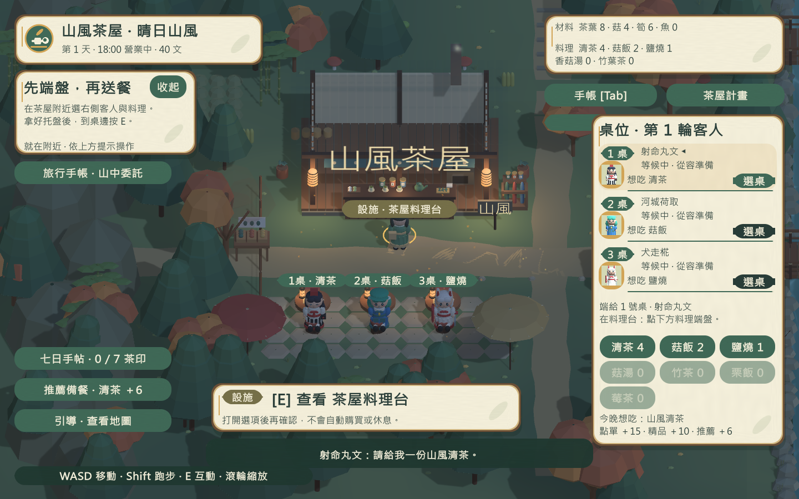
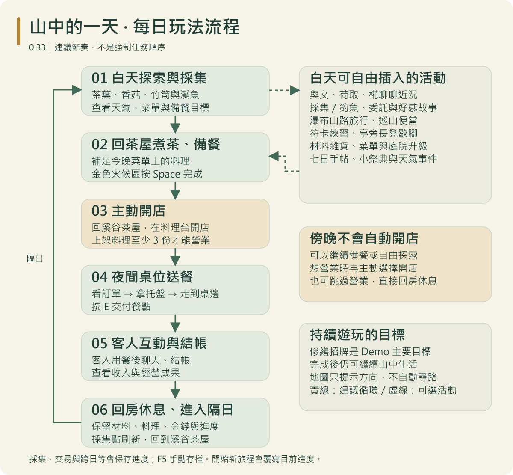
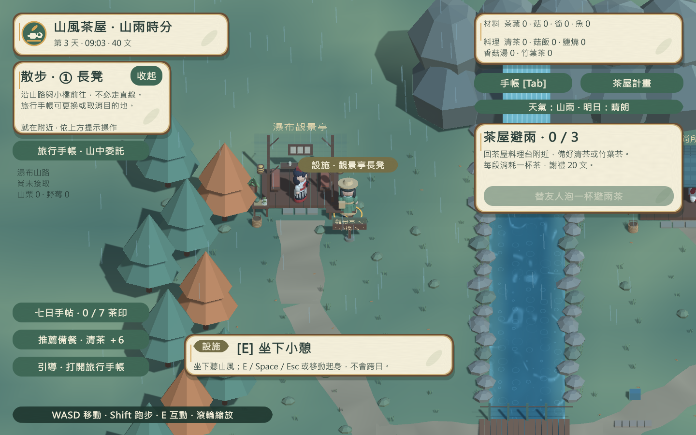
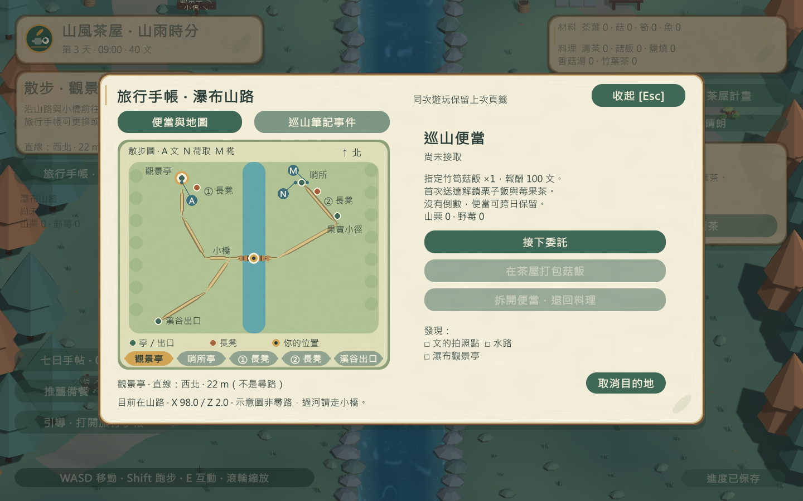
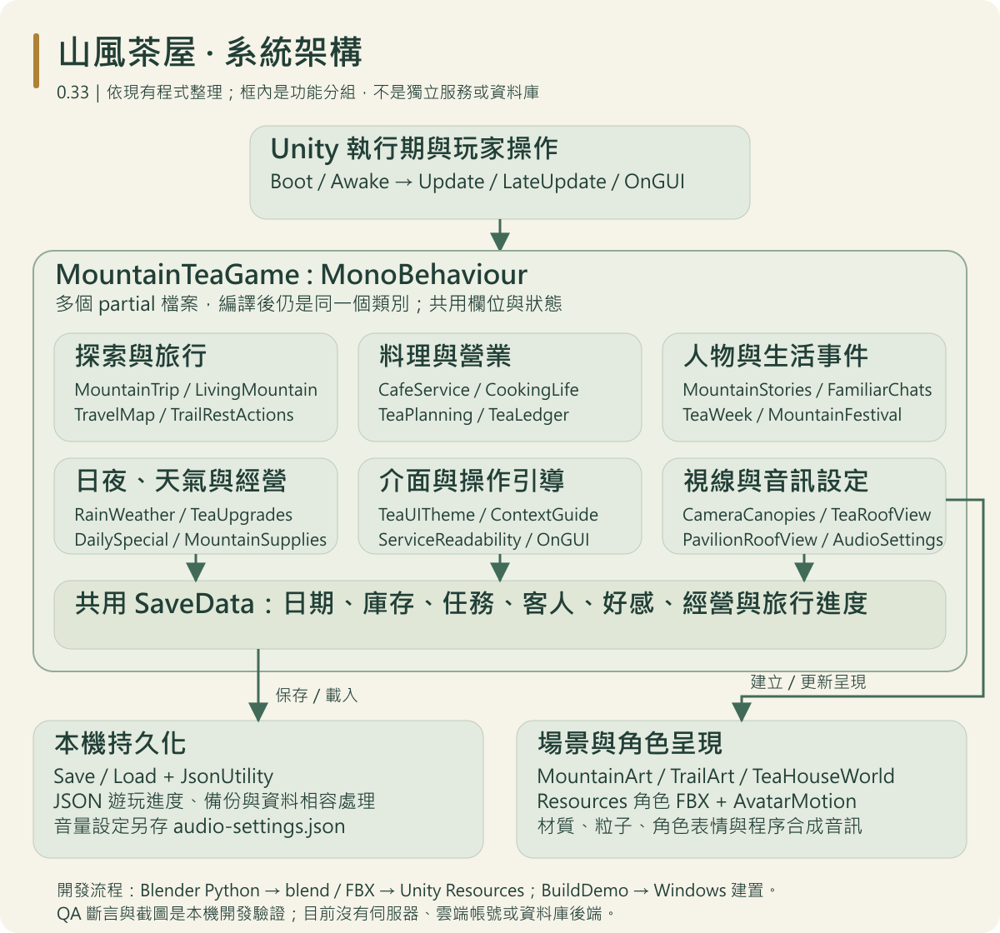

# 山風茶屋 · Mountain Wind Teahouse

在妖怪之山採一籃茶葉，為熟悉的友人留一盞燈。

《山風茶屋》是以 **東方 Project** 世界觀為背景的非官方二次創作遊戲原型，結合斜俯視 3D 探索、休閒 RPG 與茶屋經營。玩家在溪谷採集、釣魚與備餐，夜晚招待射命丸文、河城荷取和犬走椛；空閒時則沿瀑布山路散步，慢慢讀完山中的小故事。

目前版本：**0.33** · 平台：**Windows x64** · 引擎：**Unity 6000.2.0f1** · 狀態：**可玩原型，持續開發中**



## 山中的一天

白天探索採集 → 料理備餐 → 夜間開店 → 端盤送餐、聊天與結帳 → 休息跨日。



主線箭頭是建議節奏，白天的對話、委託、旅行、釣魚與庭院整理可自由穿插；傍晚不會自動開店。

- **經營自己的茶屋**：安排七道料理的菜單與備餐目標，掌握火候、端盤到桌邊，查看收入與材料支出，逐步添購庭院布置與便利升級。
- **認識山中友人**：三位角色有各自的喜好、日常對話與好感故事，還有巡山便當、遺失筆記與避雨茶事件。
- **留一點時間給風景**：探索溪谷與瀑布山路，觀察晴雨、日夜和友人巡路，在亭旁長凳坐下歇腳。旅行手帳提供地圖與目的地方位，不自動尋路或傳送。
- **按自己的步調遊玩**：七日手帖與小祭典提供生活目標；完成茶屋招牌修繕後，仍可繼續探索與經營。符卡閃避練習是可選活動，不是強制戰鬥主線。

## 實際畫面

以下皆為 0.33 Windows 執行檔的實際渲染，使用獨立測試進度，並非概念圖。

### 雨天的山路歇腳處



靠近亭子時屋頂會淡化，讓人物與互動目標保持可見；長凳小憩不扣材料，也不發放獎勵。

### 旅行手帳與散步圖



地圖呈現道路、河道、設施與友人目前位置；目的地紙籤顯示方位與直線距離，保留自行探索的節奏。

[直接播放 86 秒實玩展示影片](https://github.com/oliverchenOVO/mountain-wind-teahouse/issues/1)（GitHub 影片播放器） · [MP4 原始檔](ShowcaseDraft/video/mountain-tea-v033-story-86s.mp4)

展示順序：鏡頭拉遠展示溪谷全景 → 打開旅行手帳展示完整瀑布山路地圖 → 射命丸文與河城荷取對話 → 煮茶 → 夜間客人互動與送餐。影片剪輯自實際遊戲畫面，使用獨立示範存檔與預備材料，並非連續的新遊戲通關；配樂為遊戲音樂後製加入。

## 如何開始

目前倉庫提供 Unity 原始專案，**不包含 Windows 執行檔，也尚未發布 GitHub Release 或公開 Demo 下載**。

1. 下載或 clone 本倉庫。
2. 使用 Unity Hub 安裝 **Unity 6000.2.0f1** 與 Windows Build Support，加入專案根目錄。
3. 開啟 `Assets/Scenes/MountainTea.unity`，按 Play 即可在編輯器中體驗。
4. 若要產生 Windows Demo，使用下方建置入口；成功後雙擊根目錄的 `開始遊玩.cmd`，或執行 `Builds/WindowsV33/MountainTea.exe`。

在 PowerShell 中將 Unity 執行檔路徑替換為自己的安裝位置，並於專案根目錄執行：

```powershell
& "<Unity Editor 的完整路徑>\Unity.exe" -batchmode -quit -projectPath "$PWD" -executeMethod BuildDemo.Build -logFile "build.log"
```

建置時請先關閉同一專案的 Unity Editor。執行遊戲時須保留整個 `WindowsV33` 資料夾，不能只搬移 exe。

| 操作 | 按鍵 |
| --- | --- |
| 移動／跑步 | WASD 或方向鍵／左 Shift |
| 採集、交談、料理與設施互動 | 靠近後按 E |
| 釣魚收竿／料理火候 | 依提示按 Space |
| 手帳 | Tab |
| 暫停／取消 | Esc |
| 手動存檔 | F5 |
| 隱藏或顯示一般 HUD | F8 |
| 鏡頭縮放 | 滑鼠滾輪 |

第一次遊玩可先採集茶葉，在料理台準備至少三份上架料理，再開始營業。需要完整流程與存檔說明時，請看 [遊玩指南](docs/PLAYING.md)。**「開始新旅程」會覆寫目前進度**，建議先備份存檔。

## 技術與開發重點



架構以一個 `MountainTeaGame : MonoBehaviour` 為核心，多個 `partial` 檔案整理不同功能，共用 `SaveData`；目前不是獨立服務或資料庫架構。[每日流程 SVG](ShowcaseDraft/images/daily-flow.svg) · [系統架構 SVG](ShowcaseDraft/images/system-architecture.svg)

本專案從基本採集與營業循環逐步擴充至角色故事、山路旅行、天氣、茶屋生活與介面可讀性。各版細節收錄於 [更新紀錄](CHANGELOG.md)，後續方向見 [開發筆記](DEVELOPMENT.md)；Git commit history 保留實際迭代過程。

- **Unity C# 遊戲系統**：探索、備餐、送餐、結帳與跨日狀態相互配合，處理庫存、獎勵與重複操作。
- **程序生成美術**：溪谷、茶屋、亭舍、植被與介面以程式生成；低多邊形角色由專案內 Blender Python 腳本製作。
- **情境式引導**：按送餐、便當、營業與探索狀態安排提示優先序，並以樹冠和屋頂淡化改善斜俯視視線。
- **存檔相容與回歸檢查**：檢查舊版資料、跨日、交易與重複領獎，避免新功能破壞既有進度。

| 位置 | 內容 |
| --- | --- |
| `Assets/Scripts/` | 遊戲邏輯、角色動作、介面、場景與驗證程式 |
| `Assets/Resources/` | 角色 FBX 與 shader |
| `Assets/Scenes/MountainTea.unity` | 遊戲入口場景 |
| `ArtSource/` | Blender 角色來源 |
| `Tools/create_characters.py` | 角色模型生成腳本 |
| `Assets/Editor/BuildDemo.cs` | Windows 建置入口 |

建置產物、Unity 快取、玩家存檔與本機 QA 輸出不納入版本管理。模型來源是既有 Blender 3.1 工作流程；若改用其他版本重新生成，需另行驗證匯出結果。

## 已知限制

這是一份開發中原型，不是完成版商業遊戲。角色動作使用分離網格與程式轉軸，尚未加入完整蒙皮骨架、配音、四季或大型主線；庭院布置也不是自由擺放系統。

0.33 的既有本機 Windows 驗證紀錄包含 **1,218 項自動斷言與 146 張遊戲截圖**，另有人工畫面檢查。這些是先前的開發驗證結果，不是此次文件更新重新執行的測試，也不等於完整手動遊玩、第三方認證或零缺陷。測試曾出現間歇性的 Unity JobTempAlloc 配置警告，根因尚未定位；音訊尚未完成完整人工試聽。

## 製作方式與 AI 協作

維護者：[oliverchenOVO](https://github.com/oliverchenOVO)。

本專案由維護者與 AI 開發助手協作。維護者提出東方主題、妖怪之山與休閒 RPG／茶屋混合的方向，提供試玩及視覺回饋並選擇迭代方向；AI 助手參與程式撰寫、模型生成腳本、建置與自動驗證。不將本作品描述為所有程式與素材均由維護者獨立手寫。

更完整的素材與工具說明見 [來源與製作方式](ShowcaseDraft/CREDITS.md)。

## 二次創作與使用聲明

東方 Project 原作為 **上海アリス幻樂団 / ZUN**。本作是非官方二次創作，不宣稱獲得官方合作、背書或個別授權；原作角色與世界觀權利屬原權利人。相關發佈仍須遵守 [東方 Project 官方二次創作指南](https://touhou-project.news/guidelines_en/) 及適用的第三方條款。

本倉庫用於作品展示與開發歷程記錄，**不是採用開源授權的專案**；不授予額外的改作、素材抽取、再散布或商業利用許可，詳見 [作品展示與權利保留聲明](LICENSE.txt)。GitHub 平台必要的查看與 fork 權利、適用法律例外及第三方權利另行適用，公開倉庫無法技術上禁止複製。`LICENSE-DRAFT.txt` 僅保留為先前草案紀錄，不是另一份有效授權。

---
[更新紀錄](CHANGELOG.md) · [遊玩指南](docs/PLAYING.md) · [開發筆記](DEVELOPMENT.md) · [素材與製作方式](ShowcaseDraft/CREDITS.md)
